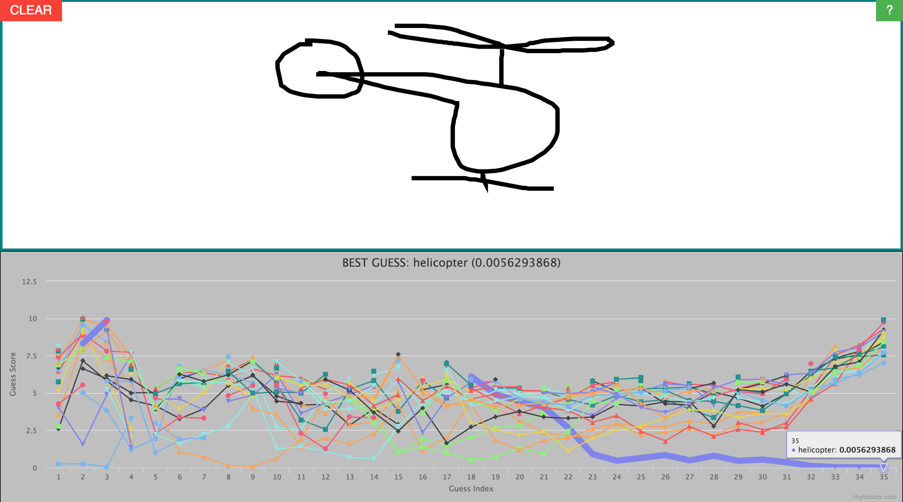
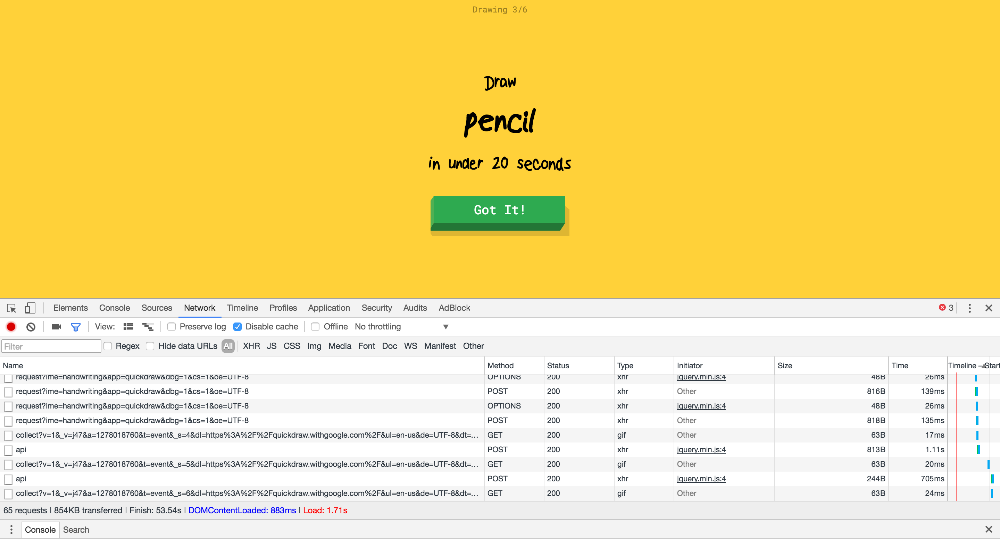
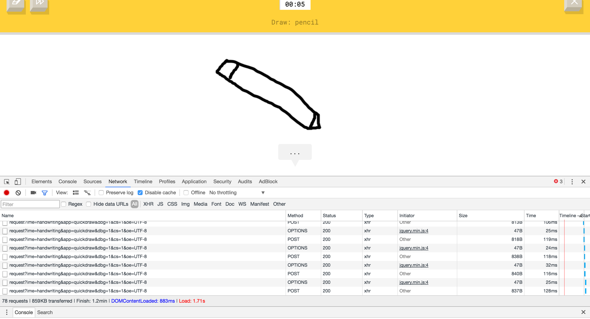
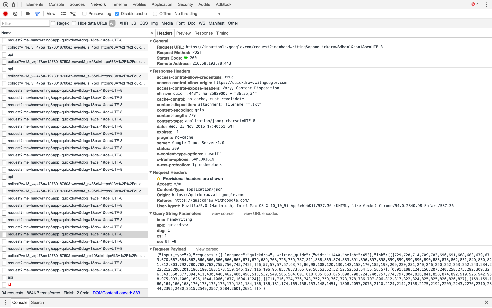
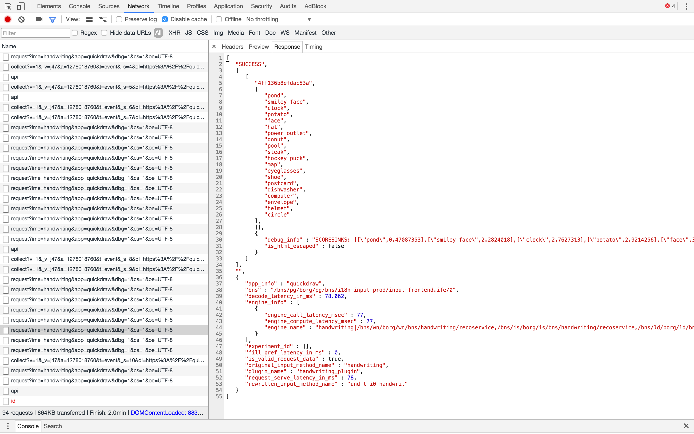
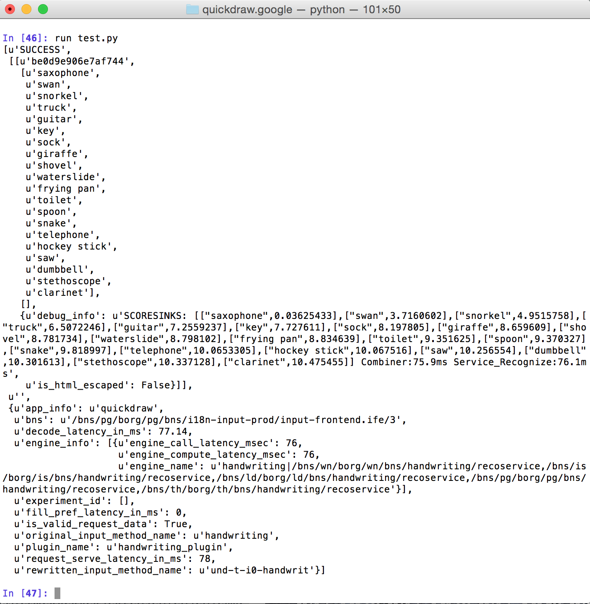

# web-demo-quickdraw-visualizer

TLDR: Google recently launched a web tool called Quick Draw which asks you to draw an object then tries to guess that object using a Neural Network AI. I "reverse-engineered" it and made my own drawing-guessing tool which leverages the same Google AI but adds some extra visualization.

To check out the drawing tool, go to <a href="https://engelsjk.github.io/web-demo-quickdraw-visualizer/" target="_blank">https://engelsjk.github.io/web-demo-quickdraw-visualizer/</a> and start drawing! You'll quickly see a plot of "guesses" of what object you're drawing and their relative fit scores, all provided by the Google AI behind the Google Quick Draw tool.

<h1>Summary></h1>

Google Quick Draw

<a href="https://quickdraw.withgoogle.com/" target="_blank">https://quickdraw.withgoogle.com/</a>

Initially, I was simply curious to know how the Google Quick Draw web tool worked, so I set out to investigate the client-server interactions which allow drawing and guessing. This investigation ended up consisting of four parts:

<ol>
<li>How Does Quick Draw Actually Work?</li>
<li>Can I Make a Chrome Extension that Visualizes More of the Quick Draw Data?</li>
<li>Can I Use the Google AI API from Python?</li>
<li>Can I Make My Own Web Tool Using the Google AI API?</li>
</ol>

<h1>Quick Draw</h1>
First, I set out to look at the network calls of the Quick Draw web tool using the Chrome DevTools. When starting the Quick Draw page, it first asks you to draw an object which it will then try to guess.

As you draw, a lot of POST requests are sent to what appears to be an API endpoint at <i>inputtools.google.com</i>.

(You can also see an OPTION request for each POST request, but I ignored those for this investigation assuming that I wouldn't be able to interpret their intent from the client side.)

The most important part of these POST requests is the data payload itself, which consists of a JSON string with two main components: (i) the drawing canvas width/height and (ii) an "ink" array that consists of three arrays of numbers.

<b>IMPORTANT: This "ink" array is obviously the data behind the canvas drawing in some format. It took a bit of trial-and-error, but I eventually figured out that the ink array includes values for X,Y as well as time in the following format:</b> 

<code>ink=[[x1, x2, ...],[y1, y2, ...],[t1, t1, ...]]</code>

<b>This realization will come in very handy later on!</b>

The response to each of these POST requests is some JSON data that includes (i) the results of the drawing guesses and (ii) what appears to be some details about the Google AI engine (e.g. call and compute latency).   

<h1>Chrome Extension</h1>

After realizing that the Quick Draw web tool had more data behind than it was letting on (specifically 20 guesses and scores for each API call), I wanted to visualize that data and my first thought was a small Chrome Extension showing a plot of the guesses and scores.

Having played around with Chrome Extensions before (<a href="https://github.com/engelsjk/chrome-extension-redpandamonium">Red Pandamonium</a>), I knew enough to be dangerous but not enough as I would soon find out. Not knowing anything about how to see HTTP request data in a Chrome Extension, I quickly found the <a href="https://developer.chrome.com/extensions/webRequest" target="_blank">chrome.webRequest API</a>. Since the webRequest API only runs in a Background Page, I whipped up a quick <code>manifest.json</code> with an empty <code>content.js</code> and a Background Page .js file. This Background Page only <code>console.log</code>s data from the different web request events, mostly to try and parse out request/response headers and body data. It only works on the Googe Quick Draw webtool and only grabs network events from the Google AI API URL. 

To see the <code>console.log</code>'d output of a Background Page, you need to Inspect View of the Background Page in the Chrome Extensions manager (<a href="chrome://extensions/" target="_blank">chrome://extensions/</a>). 

This will bring up a separate console window and will start outputting web request data as you use the Quick Draw web tool.

Unfortunately, I failed to realize that the chrome.webRequest API does not allow access to response body data, which is where the Google AI API guessing results are contained. This threw a wrench into my plan because without that data in the Chrome Extension background, I obviously wouldn't be able to visualize it the way I wanted.

***Repository for Chrome Extension***
<a href="https://github.com/engelsjk/chrome-extension-quickdraw-requests" target="_blank">https://github.com/engelsjk/chrome-extension-quickdraw-requests</a>

<i>References</i>
<ul>
<li><a href="https://robots.thoughtbot.com/how-to-make-a-chrome-extension" target="_blank">https://robots.thoughtbot.com/how-to-make-a-chrome-extension</a></li>
<li><a href="https://developer.chrome.com/extensions/webRequest" target="_blank">https://developer.chrome.com/extensions/webRequest</a></li>
<li><a href="http://stackoverflow.com/questions/15502691/chrome-webrequest-not-working" target="_blank">http://stackoverflow.com/questions/15502691/chrome-webrequest-not-working</a></li>
<li><a href="http://stackoverflow.com/questions/10257301/where-to-read-console-messages-from-background-js-in-a-chrome-extension" target="_blank">http://stackoverflow.com/questions/10257301/where-to-read-console-messages-from-background-js-in-a-chrome-extension</a></li>
</ul>

<h1>Python</h1>

Realizing that I couldn't access the Google AI guessing results via a Chrome Extension, I was still curious to figure out a way to visualize the results more than what is shown on the Quick Draw web tool. Having played around with the HTTP request/response data, I wondered if that Google AI API would be accessible from something other than the Quick Draw web tool itself.

Using the handy Chrome DevTool feature of copying network requests as cURL strings, I made a simple Python script to try and get a response from the Google AI API using the Requests package.

I manually recreated the structure of the cURL string into the necessary Requests format. I copied the "ink" array of X-Y-Time data from a previous Quick Draw network call but made it a variable in the Python script in case I wanted to try out different drawing data. Then, I just sent the POST request with the data payload and...

It worked! 

Now, maybe this shouldn't have come as a surprise to me but it was an exciting realization nonetheless. Knowing that I can use the Google AI API outside of the Quick Draw web tool, I decided to make my own version...

***Repository for Chrome Extension***
<a href="https://github.com/engelsjk/python-test-googledraw-api" target="_blank">https://github.com/engelsjk/python-test-googledraw-api</a>

<h1>Quick Draw Visualizer</h1>

Having dug into the Google Quick Draw web tool, I knew that they were using <a href="http://paperjs.org/about/" target="_blank">Paper.js</a> as the canvas drawing framework. Figuring that was as good a place as any to start, I quickly found a basic Paper.js drawing app on Codepen.io to use as a starting point.

The first trick to figure out was how to generate the 3-vector "ink" array for the API data payload. It was simple enough to create a mouse-drag event listener which built up the XY coordinates from the canvas element as a user draws, but the time array was the tricky part. The timestamp for the event listener is in epoch milliseconds but the "ink" time array appeared to be milliseconds since "pen hit the paper", so to speak. I ended up inititalizing the time array starting at 0, calculating the time delta in milliseconds between subsequent event listeners, and then building up the time array by adding the time delta to the last value in the time array. This time array only resets back to <i>t_0 = 0</i> when the user CLEARS the canvas.

Another trick involving time was figuring out how often to call the Google AI API. The mouse drag event listener can fire on the order of 10's of milliseconds, but calling the Google AI API that often would be overkill. I didn't dig through the Google Quick Draw source code enough to identify how often they're calling the API, but I settled on a delay of 250 milliseconds between each API call. This seems to work well in terms of the plotting visualization, which is updated each time a new API call is made.

The last trick was manipuating the data structure of the guessed results (guessed object name and guess score) that are returned by the Google AI API call in order to plot the results. I settled on using <a href="http://www.highcharts.com/" target="_blank">Highchart.js</a> for plotting since I'm familiar with it and it seemed to have the easiest method of creating multiple line series. In order to capture all possible guesses that could be returned by the API, I just used an object (<code>d_scores</code>)where each guessed object name is a different key. The value of each key is an array of  guess scores with a length equal to the total number of guesses. Anytime an API call is returned, there are 20 guessed object names and their associated scores, so I just loop through them all and check if the guessed object name already exists in <code>d_scores</code>. If it does, append the new guess score to that key-value array. If it doesn't, append <code>null</code>. Then, to keep up with the key-value arrays of guessed object names that weren't returned by that API call, loop through each key in <code>d_scores</code> and if it wasn't in the API return, append <code>null</code>. The result of this is a full set of all guessed object names with arrays of guess scores, where all lengths are equal to the total number of guesse at all points in time. This set can easily be passed to Highcharts as the data input for a multiple data series line chart.

<i>References</i>
<ul>
<li><a href="https://codepen.io/anon/pen/ObmQmB" target="_blank">https://codepen.io/anon/pen/ObmQmB</a></li>
</ul>

<h1>Conclusion</h1>

Overall, this was a great learning experience. Whenever I see a new interesting web tool, I find myself going straight to Chrome DevTools to see what network calls are being made. In the case of the Google Quick Draw tool, the combination of realizing that the drawing guesses were being made by an API call, that the API response contained more information than was being displayed in the web tool, and the fact that the "open" API could be called from origins other than the Quick Draw tool made this a compelling project to piece together.

The visualizer web tool I made is no doubt clunky and could use some cleaning up (API handling, visualization, data structure generation, etc). But for a project that went from looking at HTTP responses in a Google web tool to building my own visualizer in less than a week over Thanksgiving holiday, I'm very happy with it!

